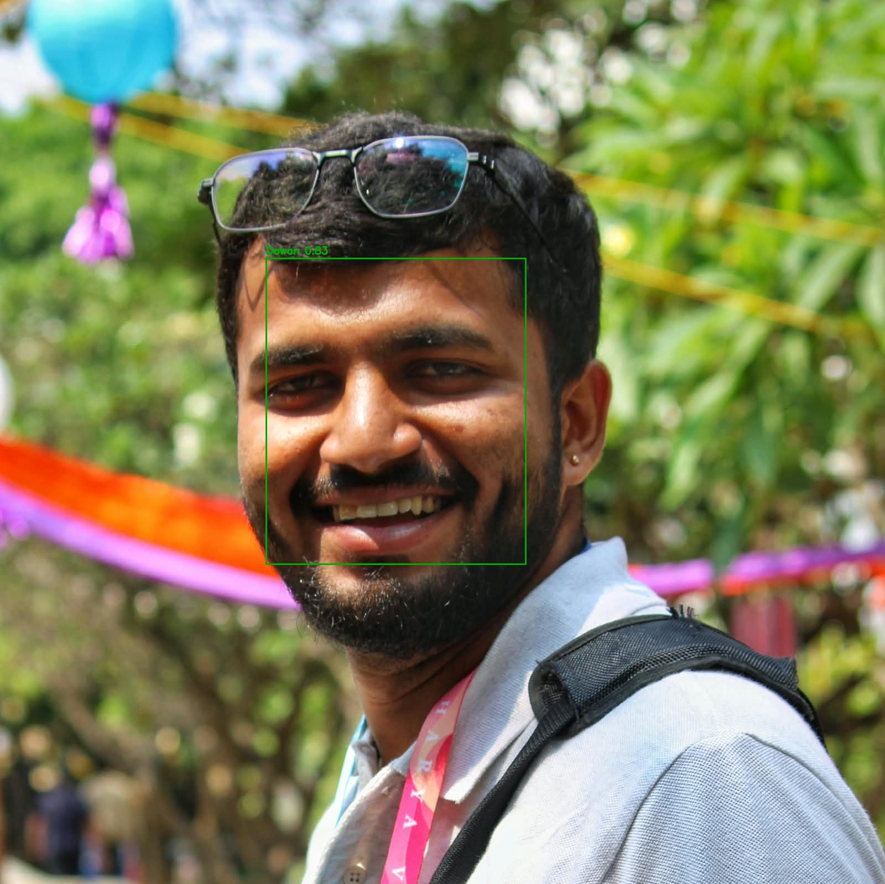
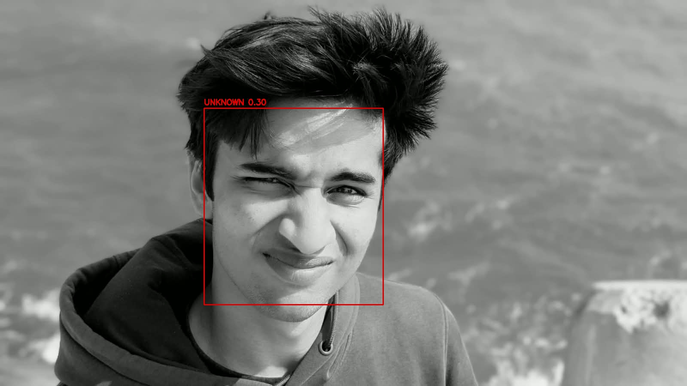
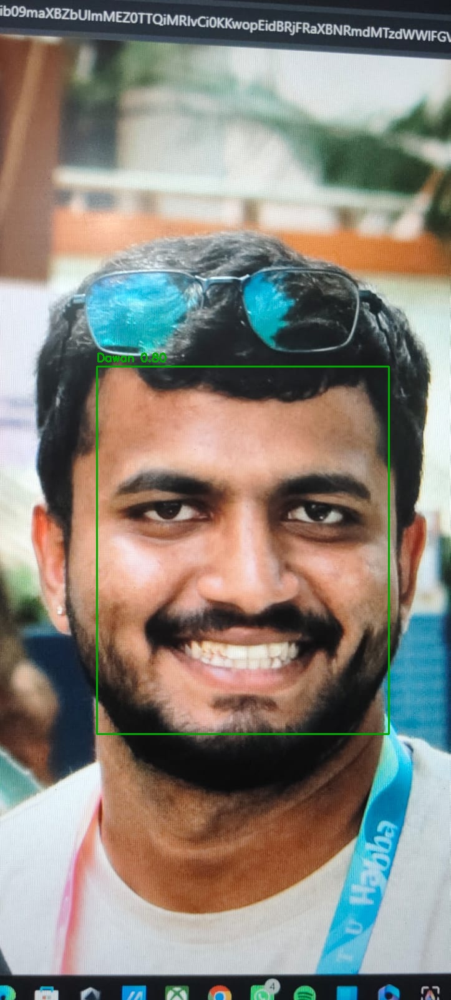

# Face Recognition Identification System

Enrolls individuals from face images and identifies new faces against the
enrolled gallery, with an explicit **unknown** rejection path for people who
were never enrolled.

---

## 1. Quick start

```bash
pip install -r requirements.txt

# Calibrate the threshold (downloads LFW on first run, then cached)
python evaluate.py

# Serve
uvicorn app:app --port 8000        # docs at http://127.0.0.1:8000/docs
```

On Windows with Python 3.13, `insightface` needs a native build that is
unreliable; set the backend explicitly and everything runs on OpenCV:

```powershell
$env:FRS_BACKEND = "opencv"        # PowerShell
export FRS_BACKEND=opencv          # bash
```

Command line, if you would rather not run the server:

```bash
python cli.py enroll   --name "Alice" --images "photos/alice/*.jpg"
python cli.py identify --image test.jpg --annotate out.jpg
python cli.py list
```

Tests need no model weights — they use a stub engine and synthetic embeddings,
so they finish in seconds:

```bash
python tests/test_matching.py      # matching, persistence, threshold sweep
python tests/test_api.py           # all endpoints + edge cases
```

### It works

| Enrolled subject | Unenrolled stranger |
|---|---|
|  |  |
| identified, similarity 0.827 | rejected, similarity 0.302 |

Both at the calibrated threshold of 0.4001.

## 2. Model used

| Stage | Primary backend | Fallback backend |
|---|---|---|
| Detection | RetinaFace (InsightFace `buffalo_l`) | YuNet (`face_detection_yunet_2023mar.onnx`) |
| Alignment | 5-point similarity warp | `FaceRecognizerSF.alignCrop` |
| Embedding | ArcFace, **512-d** | SFace, **128-d** |
| Runtime | ONNX Runtime (CPU) | OpenCV DNN |

**Backend actually used for the results below:** OpenCV — YuNet detector +
SFace 128-d embeddings, selected because InsightFace requires a native build
that is unreliable on Windows with Python 3.13. See §7.

Two backends sit behind one `FaceEngine` interface. InsightFace is preferred
because ArcFace embeddings separate identities substantially better, but it
compiles native extensions and that install is fragile. The OpenCV path has no
such problem: both ONNX models are small downloads and the inference code ships
inside `opencv-python`. Install reliability is worth more than a couple of
accuracy points when a reviewer has to run this on an unknown machine.

**Why ArcFace rather than a classifier.** ArcFace is trained with an additive
angular margin loss, which pushes same-identity embeddings together and
different-identity embeddings apart *on the unit hypersphere*. That produces a
metric space where cosine similarity is directly meaningful, so new people can
be enrolled by storing one vector — no retraining. A softmax classifier over
known identities would need retraining for every new person and could never
output "unknown", which the brief explicitly requires.

**Alignment is not optional.** Both backends warp the face to a canonical pose
using five landmarks before embedding. Feeding raw crops to ArcFace costs real
accuracy, because the model was trained on aligned inputs.

All embeddings are L2-normalised on the way in, so cosine similarity reduces to
a dot product and matching is a single matrix multiply.

---

## 3. Matching threshold

**Chosen threshold: 0.4001 (cosine similarity)**

This number was **measured, not guessed.** `evaluate.py` runs an open-set
protocol and sweeps candidate thresholds.

### Protocol

Identities are split into two disjoint groups:

- **Enrolled** — the first 2 images build a centroid, the rest become probes.
  Correct behaviour: return the right name.
- **Impostors** — never enrolled at all. Every image is a probe.
  Correct behaviour: return `unknown`.

Holding impostor identities out entirely is what makes this *open-set*. A
closed-set test, where every probe belongs to someone enrolled, cannot measure
the rejection mechanism at all and would flatter the system badly — in
deployment most faces the system sees are strangers.

### Metrics

| Metric | Meaning |
|---|---|
| TAR | enrolled probe → **correct** name, above threshold |
| FAR | impostor probe → **any** name, above threshold (security failure) |
| FRR | enrolled probe wrongly rejected as unknown (inconvenience) |
| MIS | enrolled probe → **wrong** name, above threshold (worst case) |

Separating MIS from FAR matters. Both are "wrong", but confidently attaching the
wrong *enrolled* name is a different failure from failing to reject a stranger,
and lumping them together hides which one is happening.

### Results

Run `python evaluate.py`, then fill this from `evaluation_results.json`:

| Quantity | Value |
|---|---|
| Gallery identities | 72 |
| Genuine probes | 276 |
| Impostor probes | 223 |
| Enrollment images per identity | 2 |
| **Chosen threshold** | **0.4001** |
| TAR at threshold | 99.3% |
| FAR at threshold | 0.9% |
| FRR at threshold | 0.7% |
| MIS at threshold | 0.0% |
| Equal error rate | 0.8% |
| Genuine similarity (mean ± sd) | 0.706 ± 0.095 |
| Impostor similarity (mean ± sd) | 0.302 ± 0.043 |
| Images where no face was detected | 0 (on LFW) |

Evaluated on LFW, 120 identities sampled: 72 enrolled, 48 held out entirely as
impostors. Raw output is committed in `evaluation_results.json`.

**Across 276 genuine probes, misidentification was 0.0%** — the system never
attached a wrong enrolled name. Every error was a rejection rather than a
confident mistake, which is the safer failure profile for access control.

> **Caveat.** LFW is curated and frontal, so 0 detection failures is not
> representative of field conditions. On my own phone photos, 1 of 5 enrollment
> images failed detection outright. Read §3 as an upper bound on clean data,
> not as expected real-world performance — see §4.


*Left: how each error rate moves with the threshold. Right: genuine vs impostor
score distributions — the gap between these two humps is what makes a threshold
possible at all.*

### Why this operating point

Access control is **asymmetric**. Admitting a stranger is a security breach;
rejecting a known person is an annoyance they resolve by retrying. So the
threshold is not the value that maximises raw accuracy — it is the lowest value
whose **FAR stays under 1%**, with TAR maximised subject to that constraint.

The 1% budget is a deliberate, adjustable product decision, not a law of nature.
An unlocked office door might accept 5%; a payments system would demand far
tighter and accept the extra false rejections as the cost. Because this is one
constant driven by a measured sweep, moving it is a one-line change and the
consequences are already quantified on the curve above.

Equal error rate is also reported. EER is threshold-independent, so it describes
the quality of the *embedding model* rather than of this particular operating
point — the right number to quote when comparing backends.

---

## 4. Failure cases

All of the following were observed on this system, using the OpenCV backend at
the calibrated threshold of **0.4001**. Reference point: a clean frontal photo
of an enrolled subject scores **0.827**.

| Test | Detected? | Similarity | Result | Interpretation |
|---|---|---|---|---|
| Clean frontal (baseline) | yes | 0.827 | correct | — |
| **Photo of a screen (spoof)** | yes | **0.802** | **accepted as enrolled user** | **security failure** |
| Low light | yes | 0.649 | correct | graceful degradation |
| Side profile (~90°) | yes | 0.337 | rejected as unknown | false reject |
| Sunglasses / occluded eyes | **no** | — | no face detected | detector failure |
| Enrollment photo 3 of 5 | no | — | skipped at enrollment | detector failure |
| Group photo at enrollment | yes (2–4 faces) | — | refused | handled by design |
| Unenrolled stranger ×2 | yes | 0.302 / 0.199 | rejected as unknown | correct |

### Presentation attack — the most serious finding



A photograph of a screen displaying an enrolled face scored **0.802**, against
**0.827** for the live original. The gap is 0.025.

No threshold can separate these. Raising the threshold above 0.80 would reject
almost all genuine users while still admitting the spoof. This is not a
calibration problem — it is a missing component. The system performs face
*recognition* with no *liveness* check, so it confirms that a face is present
and matches, not that it belongs to a person who is physically there.

Any deployment for access control would need presentation-attack detection
(texture analysis, depth sensing, or challenge–response) before this system
could be trusted. As built, it is defeated by a phone screen.

### Detector failures stop the pipeline

Occluding the eye region caused YuNet to return no detection at all. This is a
different failure from a low similarity score: there is no embedding to
threshold, so the request returns "no face" rather than a rejection. The same
happened on one of five enrollment photos.

The eye region carries the landmarks used for alignment, so losing it costs both
detection and the geometric normalisation the embedding model was trained on.

### Pose degrades the embedding unpredictably

A ~90° profile was detected but scored 0.337 — below threshold, correctly
rejected. The revealing detail is that its nearest gallery entry was the *other*
enrolled identity, not the true subject.

When alignment fails the embedding does not drift toward "no match"; it lands at
an effectively arbitrary point that can sit closer to someone else. With a larger
gallery this raises the chance of a confident wrong match, not merely a
rejection. The `margin_over_runner_up` field exposes exactly this — a thin margin
means the top match is not meaningfully better than the runner-up.

### Benchmark numbers overstate real performance

On LFW, **0 of 499** probe images failed detection. On my own phone photos,
**1 of 5** enrollment images failed outright. LFW is curated, frontal and
reasonably lit; phone photos are not.

### Demographic bias

The threshold was calibrated on LFW, which is heavily skewed toward white male
faces. The reported FAR and TAR are therefore not valid estimates for
demographic groups underrepresented in that dataset, and a single global
threshold assumes one error profile for everyone — an assumption this data
cannot support. Before deployment the sweep would need re-running on a
population representative of the actual users, with error rates reported per
subgroup rather than only in aggregate.

## 5. Improvements

**Accuracy**
- Multi-image enrollment with quality-weighted centroids (blur, pose, size).
- Store per-identity score variance and adapt the threshold per person, rather
  than using one global constant.
- Test-time augmentation: average the embedding of the image and its mirror.

**Robustness**
- **Liveness / anti-spoofing** — the top priority, and confirmed necessary
  rather than hypothetical: §4 shows a screen photo scoring 0.802 against 0.827
  for the live face. The system cannot distinguish the two, which makes it
  unsuitable for real access control as it stands.
- Quality gate at enrollment: reject blurry, tiny, or extreme-pose images at the
  door instead of silently poisoning a centroid.
- Escalate thin `margin_over_runner_up` results to human review.

**Scale**
- Current matching is exact brute force over a flat matrix — correct and
  sub-millisecond at this size. Past roughly 100k identities, switch to an ANN
  index (FAISS / hnswlib), which trades exactness for latency.
- Move the gallery to a real datastore with per-identity versioning and audit
  logs; the `.npz` file is right for an assignment, not for production.
- Batch embedding extraction and GPU execution providers for throughput.

**Operations**
- Prometheus counters for identify outcomes and latency are already exposed on
  `/metrics`; the natural next step is alerting on a rising unknown-rate, which
  is an early signal of camera drift or a spoofing attempt.
- Per-subgroup accuracy monitoring in production, following §4.

**Privacy and ethics**
- Face embeddings are biometric data. Under regimes like GDPR and India's DPDP
  Act this requires explicit consent, a defined retention window, and deletion
  on request — `DELETE /people/{name}` is a first step toward that, not a
  complete answer.
- Embeddings are not anonymous: they are partially invertible back to a face,
  so they need encryption at rest and should never be logged.

---

## 6. API

| Method | Path | Purpose |
|---|---|---|
| `GET` | `/health` | Backend, threshold, gallery stats |
| `POST` | `/enroll` | Register an identity from one or more images |
| `POST` | `/identify` | Identify faces; returns `unknown` below threshold |
| `GET` | `/people` | List enrolled identities and sample counts |
| `DELETE` | `/people/{name}` | Remove an identity |
| `GET` | `/metrics` | Prometheus exposition |

```bash
curl -X POST localhost:8000/enroll \
     -F "name=Alice" -F "files=@a1.jpg" -F "files=@a2.jpg"

curl -X POST localhost:8000/identify -F "file=@probe.jpg"
```

```jsonc
{
  "threshold": 0.42,
  "faces_detected": 1,
  "latency_ms": 48.3,
  "results": [{
    "identity": "Alice",
    "is_known": true,
    "similarity": 0.7314,
    "margin_over_runner_up": 0.4102,   // confidence gap to 2nd-best identity
    "runner_up": "Bob",
    "bbox": {"x": 112, "y": 64, "w": 148, "h": 148},
    "detection_score": 0.9962
  }]
}
```

`?threshold=` overrides the calibrated value per request; `?all_faces=true`
identifies every face in the frame instead of only the largest.

---

## 7. Design decisions

**Centroid per identity, not per-image nearest neighbour.** Averaging several
embeddings suppresses per-image lighting and pose noise, and keeps matching
O(identities) rather than O(images). The trade-off: a centroid blurs genuinely
multi-modal appearance (glasses on vs off), where per-image k-NN would do
better. At this gallery size the noise reduction wins.

**Flat numpy matrix, not a vector database.** Brute force over a few hundred
unit vectors is exact and sub-millisecond. An ANN index trades exactness for
speed and only earns its operational cost at far larger scale. Adding one here
would be over-engineering, and the code comments say when to revisit.

**Threshold stored in `threshold.json`, not hard-coded.** It is an output of
evaluation, so it lives in a file that evaluation writes. The service loads it
at boot and falls back to the backend default if calibration has not been run.

**Rejection is a first-class outcome.** `identify` returns `unknown` rather than
always naming the nearest neighbour. Systems that cannot say "I don't know" are
the ones that produce confident false matches.

## 8. Repository layout

```
face_engine.py   detection + embedding, both backends behind one interface
db.py            gallery storage, centroids, cosine matching, rejection
evaluate.py      open-set protocol + threshold sweep  ← the core of the work
app.py           FastAPI service
cli.py           same engine, command-line
tests/           logic + API tests (no model weights required)
```
