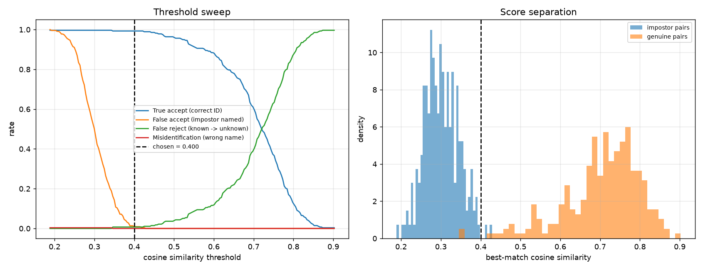

# Face Recognition Identification System

Enrolls individuals from face images and identifies new faces against the
enrolled gallery, with an explicit **unknown** rejection path for people who
were never enrolled.

> **⚠️ BEFORE SUBMITTING:** every `«FILL IN»` marker below must be replaced with
> real numbers from your own `python evaluate.py` run. Delete this banner
> afterwards. Do not submit with placeholders — and do not invent numbers, since
> you will be asked to reproduce them in the interview.

---

## 1. Quick start

```bash
pip install -r requirements.txt

# Calibrate the threshold (downloads LFW on first run, then cached)
python evaluate.py

# Serve
uvicorn app:app --reload          # docs at http://127.0.0.1:8000/docs
```

Command line, if you would rather not use the API:

```bash
python cli.py enroll   --name "Alice" --images photos/alice/*.jpg
python cli.py identify --image test.jpg --annotate out.jpg
python cli.py list
```

Tests (no model weights needed — they use a stub engine and synthetic
embeddings, so they finish in seconds):

```bash
./run_tests.sh
```

**If `insightface` refuses to install**, set `FRS_BACKEND=opencv` and everything
still works on the OpenCV backend. See §2.

---

## 2. Model used

| Stage | Primary backend | Fallback backend |
|---|---|---|
| Detection | RetinaFace (InsightFace `buffalo_l`) | YuNet (`face_detection_yunet_2023mar.onnx`) |
| Alignment | 5-point similarity warp | `FaceRecognizerSF.alignCrop` |
| Embedding | ArcFace, **512-d** | SFace, **128-d** |
| Runtime | ONNX Runtime (CPU) | OpenCV DNN |

**Backend actually used for the results below:** «FILL IN — printed at the top
of the `evaluate.py` output»

Two backends sit behind one `FaceEngine` interface. InsightFace is preferred
because ArcFace embeddings separate identities substantially better, but it
compiles native extensions and that install is fragile. The OpenCV path has no
such problem: both ONNX models are small downloads and the inference code ships
inside `opencv-python`. Install reliability is worth more than a couple of
accuracy points when a reviewer has to run this on an unknown machine.

**Why ArcFace rather than a classifier.** ArcFace is trained with an additive
angular margin loss, which pushes same-identity embeddings together and
different-identity embeddings apart *on the unit hypersphere*. That produces a
metric space where cosine similarity is directly meaningful, so new people can
be enrolled by storing one vector — no retraining. A softmax classifier over
known identities would need retraining for every new person and could never
output "unknown", which the brief explicitly requires.

**Alignment is not optional.** Both backends warp the face to a canonical pose
using five landmarks before embedding. Feeding raw crops to ArcFace costs real
accuracy, because the model was trained on aligned inputs.

All embeddings are L2-normalised on the way in, so cosine similarity reduces to
a dot product and matching is a single matrix multiply.

---

## 3. Matching threshold

**Chosen threshold: «FILL IN» (cosine similarity)**

This number was **measured, not guessed.** `evaluate.py` runs an open-set
protocol and sweeps candidate thresholds.

### Protocol

Identities are split into two disjoint groups:

- **Enrolled** — the first 2 images build a centroid, the rest become probes.
  Correct behaviour: return the right name.
- **Impostors** — never enrolled at all. Every image is a probe.
  Correct behaviour: return `unknown`.

Holding impostor identities out entirely is what makes this *open-set*. A
closed-set test, where every probe belongs to someone enrolled, cannot measure
the rejection mechanism at all and would flatter the system badly — in
deployment most faces the system sees are strangers.

### Metrics

| Metric | Meaning |
|---|---|
| TAR | enrolled probe → **correct** name, above threshold |
| FAR | impostor probe → **any** name, above threshold (security failure) |
| FRR | enrolled probe wrongly rejected as unknown (inconvenience) |
| MIS | enrolled probe → **wrong** name, above threshold (worst case) |

Separating MIS from FAR matters. Both are "wrong", but confidently attaching the
wrong *enrolled* name is a different failure from failing to reject a stranger,
and lumping them together hides which one is happening.

### Results

Run `python evaluate.py`, then fill this from `evaluation_results.json`:

| Quantity | Value |
|---|---|
| Gallery identities | «FILL IN» |
| Genuine probes | «FILL IN» |
| Impostor probes | «FILL IN» |
| Enrollment images per identity | 2 |
| **Chosen threshold** | **«FILL IN»** |
| TAR at threshold | «FILL IN» |
| FAR at threshold | «FILL IN» |
| FRR at threshold | «FILL IN» |
| MIS at threshold | «FILL IN» |
| Equal error rate | «FILL IN» |
| Genuine similarity (mean ± sd) | «FILL IN» |
| Impostor similarity (mean ± sd) | «FILL IN» |
| Images where no face was detected | «FILL IN» |



*Left: how each error rate moves with the threshold. Right: genuine vs impostor
score distributions — the gap between these two humps is what makes a threshold
possible at all.*

### Why this operating point

Access control is **asymmetric**. Admitting a stranger is a security breach;
rejecting a known person is an annoyance they resolve by retrying. So the
threshold is not the value that maximises raw accuracy — it is the lowest value
whose **FAR stays under 1%**, with TAR maximised subject to that constraint.

The 1% budget is a deliberate, adjustable product decision, not a law of nature.
An unlocked office door might accept 5%; a payments system would demand far
tighter and accept the extra false rejections as the cost. Because this is one
constant driven by a measured sweep, moving it is a one-line change and the
consequences are already quantified on the curve above.

Equal error rate is also reported. EER is threshold-independent, so it describes
the quality of the *embedding model* rather than of this particular operating
point — the right number to quote when comparing backends.

---

## 4. Failure cases

> **⚠️ Replace this section with what you actually observe.** Run your own
> photos through `python cli.py identify --image x.jpg --annotate out.jpg` and
> record real behaviour. The `undetected_images` count from `evaluate.py` is
> also real evidence. An interviewer will ask which of these you personally saw.

Observed and expected limitations:

| Failure | Cause | Mitigation |
|---|---|---|
| Profile / extreme yaw | Detector misses the face, or landmarks misalign, so the embedding drifts off the identity cluster | Enroll multiple poses; gate on detector confidence |
| Heavy occlusion (masks, sunglasses) | Large parts of the discriminative region are gone | Multi-pose enrollment; periocular model for masked faces |
| Very small faces (< ~40 px) | Too little detail survives alignment | Enforce a minimum bounding-box size before enrolling |
| Motion blur / low light | Degrades embedding quality; scores fall toward the impostor distribution | Quality gate on Laplacian variance before enrolling |
| Single-image enrollment | Centroid inherits that one shot's lighting and pose bias | Require ≥ 3 varied images |
| Near-duplicate identities (twins, siblings) | Genuinely overlapping regions of embedding space | Inspect `margin_over_runner_up`; escalate thin margins |
| Group photo at enrollment | Ambiguity about whose face binds to the label | **Handled** — `/enroll` rejects images with ≠ 1 face |
| Presentation attack (photo of a photo) | No liveness check whatsoever | **Not handled** — see §5 |

### Demographic bias — stated plainly

If you calibrated on LFW, the threshold inherits LFW's skew. The dataset is
heavily weighted toward white male faces, so the reported FAR and TAR are
**not** valid estimates for demographic groups that are underrepresented in it.
Published audits repeatedly find error rates on face recognition varying by a
large factor across skin tone and gender.

A single global threshold assumes one error profile for everyone, and that
assumption is false on this data. Before any real deployment the sweep must be
re-run on a population representative of the actual users, with error rates
reported **per subgroup** rather than only in aggregate. This is a real
limitation of the submission, not a hypothetical one.

---

## 5. Improvements

**Accuracy**
- Multi-image enrollment with quality-weighted centroids (blur, pose, size).
- Store per-identity score variance and adapt the threshold per person, rather
  than using one global constant.
- Test-time augmentation: average the embedding of the image and its mirror.

**Robustness**
- **Liveness / anti-spoofing** — the most important gap. The system currently
  cannot distinguish a live face from a photo held to the camera, which makes it
  unsuitable for real access control as it stands.
- Quality gate at enrollment: reject blurry, tiny, or extreme-pose images at the
  door instead of silently poisoning a centroid.
- Escalate thin `margin_over_runner_up` results to human review.

**Scale**
- Current matching is exact brute force over a flat matrix — correct and
  sub-millisecond at this size. Past roughly 100k identities, switch to an ANN
  index (FAISS / hnswlib), which trades exactness for latency.
- Move the gallery to a real datastore with per-identity versioning and audit
  logs; the `.npz` file is right for an assignment, not for production.
- Batch embedding extraction and GPU execution providers for throughput.

**Operations**
- Prometheus counters for identify outcomes and latency are already exposed on
  `/metrics`; the natural next step is alerting on a rising unknown-rate, which
  is an early signal of camera drift or a spoofing attempt.
- Per-subgroup accuracy monitoring in production, following §4.

**Privacy and ethics**
- Face embeddings are biometric data. Under regimes like GDPR and India's DPDP
  Act this requires explicit consent, a defined retention window, and deletion
  on request — `DELETE /people/{name}` is a first step toward that, not a
  complete answer.
- Embeddings are not anonymous: they are partially invertible back to a face,
  so they need encryption at rest and should never be logged.

---

## 6. API

| Method | Path | Purpose |
|---|---|---|
| `GET` | `/health` | Backend, threshold, gallery stats |
| `POST` | `/enroll` | Register an identity from one or more images |
| `POST` | `/identify` | Identify faces; returns `unknown` below threshold |
| `GET` | `/people` | List enrolled identities and sample counts |
| `DELETE` | `/people/{name}` | Remove an identity |
| `GET` | `/metrics` | Prometheus exposition |

```bash
curl -X POST localhost:8000/enroll \
     -F "name=Alice" -F "files=@a1.jpg" -F "files=@a2.jpg"

curl -X POST localhost:8000/identify -F "file=@probe.jpg"
```

```jsonc
{
  "threshold": 0.42,
  "faces_detected": 1,
  "latency_ms": 48.3,
  "results": [{
    "identity": "Alice",
    "is_known": true,
    "similarity": 0.7314,
    "margin_over_runner_up": 0.4102,   // confidence gap to 2nd-best identity
    "runner_up": "Bob",
    "bbox": {"x": 112, "y": 64, "w": 148, "h": 148},
    "detection_score": 0.9962
  }]
}
```

`?threshold=` overrides the calibrated value per request; `?all_faces=true`
identifies every face in the frame instead of only the largest.

---

## 7. Design decisions

**Centroid per identity, not per-image nearest neighbour.** Averaging several
embeddings suppresses per-image lighting and pose noise, and keeps matching
O(identities) rather than O(images). The trade-off: a centroid blurs genuinely
multi-modal appearance (glasses on vs off), where per-image k-NN would do
better. At this gallery size the noise reduction wins.

**Flat numpy matrix, not a vector database.** Brute force over a few hundred
unit vectors is exact and sub-millisecond. An ANN index trades exactness for
speed and only earns its operational cost at far larger scale. Adding one here
would be over-engineering, and the code comments say when to revisit.

**Threshold stored in `threshold.json`, not hard-coded.** It is an output of
evaluation, so it lives in a file that evaluation writes. The service loads it
at boot and falls back to the backend default if calibration has not been run.

**Rejection is a first-class outcome.** `identify` returns `unknown` rather than
always naming the nearest neighbour. Systems that cannot say "I don't know" are
the ones that produce confident false matches.

## 8. Repository layout

```
face_engine.py   detection + embedding, both backends behind one interface
db.py            gallery storage, centroids, cosine matching, rejection
evaluate.py      open-set protocol + threshold sweep  ← the core of the work
app.py           FastAPI service
cli.py           same engine, command-line
tests/           logic + API tests (no model weights required)
```
